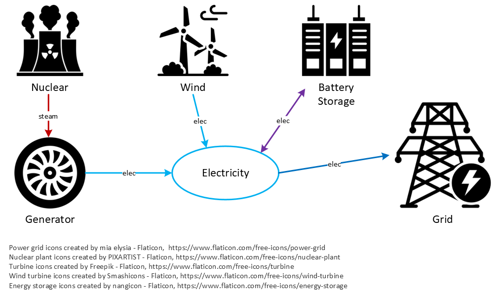

TODO: Logo here?
# Dispatch Optimization Variable Engine (DOVE)
[](https://github.com/idaholab/DOVE/actions/workflows/run-tests.yml)

# Installation

Regardless of the installation method you select, you must ensure that you have the necessary solver(s) installed on your system in order to use DOVE. DOVE uses Pyomo for optimization and supports any solver supported by your Pyomo version.

### Install Using Pip (Recommended) (TODO: Waiting on PyPI release)
If you do not need access to the source code for DOVE, the simplest method of installation is to run the following:
```
pip install dove-inl
```

### Install from Source
DOVE may be downloaded from source according to the procedure outlined below. If you would like to contribute to DOVE, please refer to the [Developers](#developers) section as you follow these instructions. If you are not interested in contributing but would still like access to the source code, these instructions are sufficient.

First, ensure that the necessary prerequisites are installed on your system:
- Python 3.11+ ([Download Python](https://www.python.org/downloads/))
- Git ([Download Git](https://git-scm.com/downloads))
- uv ([Install uv](https://docs.astral.sh/uv/getting-started/installation/))

Now navigate into the desired folder and clone the repository from github:
```
mkdir projects
cd projects
git clone https://github.com/idaholab/DOVE.git
```
Next, dependencies can be installed using uv while in the DOVE directory:
```
cd DOVE
uv sync
```
> Note that this command also automatically creates an environment located at `DOVE/.venv`, in which the dependencies are installed. Prepending `uv run` to commands while in the DOVE directory will automatically load this environment.

Finally, to verify your installation, run tests:
```
uv run pytest
```

# Quick-Start
Once DOVE has been installed, it can be used as a python library. DOVE contains three main types of objects: Resources, Components, and Systems.
- Resources refer to quantities that can be produced, consumed, converterted, and stored. Examples are electricity, heat, hydrogen, etc.
- Components are objects that perform actions on resources. Four types of Components are available in DOVE. Sources produce a specified resource; Sinks consume a specified resource; Converters change one or more resource into one or more other resources; and Storage components store resources across multiple timesteps.
- The System contains all the Resources and Components and is responsible for solving the optimization problem. Systems also take an argument to specify the time window over which the optimization should run.

Consider a simple energy system with a nuclear power plant and generator, wind turbines, and battery storage, connected to a grid. The resource flow for this system is shown below:



Dispatch for this system can be economically optimized using DOVE in a python script:

```
import dove.core as dc

steam = dc.Resource(name="steam")
elec = dc.Resource(name="electricity")

nuclear = dc.Source(name="nuclear", produces=steam, max_capacity_profile=[3, 3])
gen = dc.Converter(
    name="generator",
    consumes=[steam],
    produces=[elec],
    capacity_resource=elec,
    max_capacity_profile=[3, 3],
    transfer_fn=dc.RatioTransfer(input_res=steam, output_res=elec, ratio=1.0),
)
wind = dc.Source(name="wind", produces=elec, max_capacity_profile=[1, 2])
battery = dc.Storage(name="battery", resource=elec, max_capacity_profile=[1, 1], rte=0.9)
grid = dc.Sink(
    name="grid",
    consumes=elec,
    max_capacity_profile=[3, 6],
    cashflows=[dc.Revenue(name="elec_sales", alpha=1.0)],
)

sys = dc.System(
    components=[nuclear, gen, wind, battery, grid], resources=[steam, elec], time_index=[0, 1]
)
results = sys.solve("price_taker")
print(results)
with open("simple_demo.csv", "w") as f:
    f.write(results.to_csv())
```
This script can be run in the uv environment and will print the dispatch results as well as writing them to a csv file called "simple_demo.csv":
```
>>> uv run python examples/simple_demonstration.py
   nuclear_steam_produces  generator_electricity_produces  ...  grid_electricity_consumes  objective
0                     3.0                             3.0  ...                       -3.0        8.9
1                     3.0                             3.0  ...                       -5.9        8.9
```
> Note that the formatting for this output will differ based on the size of the terminal window. To view the complete results, run the script and open the "simple_demo.csv" file.

# Developers
Before installing DOVE, developers must install the following prerequisites in addition to those listed in the [Install from Source](#install-from-source) section:
- pre-commit (Framework for managing Git hooks)
- An IDE or text editor with Python support (e.g., VSCode, PyCharm)

Some tools frequently used by developers include:
- Git (for a variety of applications related to source control)
- uv (for environment and dependency management)
- pytest (for writing and running tests)
- ruff (for linting and formatting)
- commitizen (for versioning and standardized commits)

More extensive reference information for developers can be found at https://idaholab.github.io/DOVE/references/developer.html.
